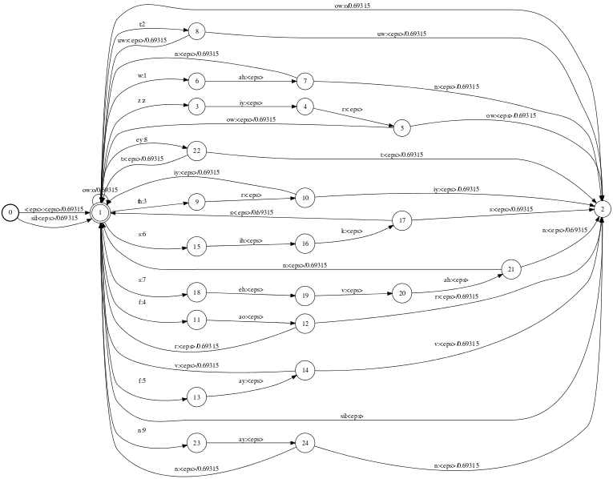

Above: An FST for pronouncing the digits 1-9 and two pronouncations of zero as:  O(o) and zero (z), as used in TIDIGITS

#Introduction
A Weighted Finite State Transducer is a generalisation of a Finite state machine.

A descent set of slides can be found [here](http://www.gavo.t.u-tokyo.ac.jp/~novakj/wfst-algorithms.pdf)

##Symbols and Strings
Symbols come from some alphabet.
They could be letters, words, phomemes, etc.

A string is a series of symbols from an alphabet, it can include the empty string.
Matching the examples above, a string could be a word (spelt out), a sentence, a word (spelt out phonetically), etc.

A string can be represented as a Finite State Acceptor, where each symbol links to the a state which links to the next.

##Finite State Acceptor (FSA)
A Finite State Acceptor has the componants of: 

 - a number of States 
     - one or more of which is initial
     - one or more of which is terminal
 - connections between states, with a input symbol (ie label)
     - the symbol could be the empty string (often writen "-" or "<eps>" or "ε")
     - Not nescisarily a one to one label to next state mapping (ie nondetermatistic)

A FSA can be used to check if a string matches its patern -- it is computationally equivelent to a regular expression. 
It can also be used to generate strings which match that pattern.

FSA&apos;s can be treated as FSTs with same input and output symbols at each edge.

##Finite State Transducers (FST)
A Finite State Transducer extends the Finite State Acceptor wih the addition of:

 - output labels on each edge
   - again the output can be the empty string.
     - it is common (such as in the TIDIGIT example above), to see only the first transition in a nonbranching substructure to be labels -- the other states have nothing to add other than confirming we are in that chain. (which we might Not be)
     - The input alphabet and output alphabet do not have to be the same, and indeed are normally not.

A FST can be used to translate strings in its input alphabet to strings in its output alphabet, iff the input string matches the FSTs structure of allowed transistions.
Thus if a FSA accepting its input alphabet is composed with it, it can translate the FSA.
A series of FSAs can be composed, translating (matched) alphabet to alphabet, to get the desired output.

##Weighted Finite State Acceptor/Transducer
As per the orginal, but with a weight assiciated with each edge (as well as input, and output for transducers)
This weight has a ⊕ and ⊗  operation defined on it,
so that weight of alternitives and that cumulitive weight along a path can be found.

 -- eg weight along a path is prouct of probabilities, and represents the probability of that input string.
 -- eg sum of weights on two edges is the probaility of either of those alternitives.

#Finite State Transnducers in Kaldi

Kaldi uses FSTs (and FSAs), as a common knowledge repressentation for all things.

#Examples:

##Filetypes

.fst.txt

##Examples provided here

This folder contains 3 examples:

##simple.fsa.txt

##Scripts

####NOTE: The example scripts assume `openfst/bin` is in your `PATH`.
Add to your .bashrc (or similar) `PATH="<...>/kaldi-trunk/tools/openfst/bin:${PATH}"`, where `<...>` is the math to the kaldi-trunk folder.
then `source ~/.bashrc`

